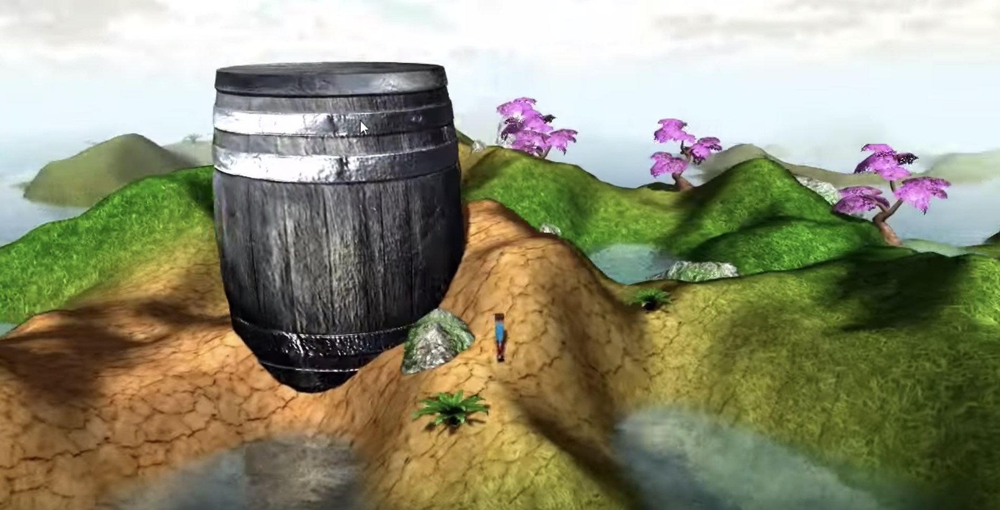

## OpenGL Tutorials
This repo contains my work after following [this](https://www.youtube.com/watch?v=VS8wlS9hF8E&list=PLRIWtICgwaX0u7Rf9zkZhLoLuZVfUksDP) tutorial. I expanded on this engine a decent bit, integrating animation and some navigation features. The engine was built using OpenGL in Java with LWJGL.

This image highlights a lot of the features of the engine, including terrain generation, water, a movable and animated character, textures, normal maps, specular shading, and many other shading features. 
